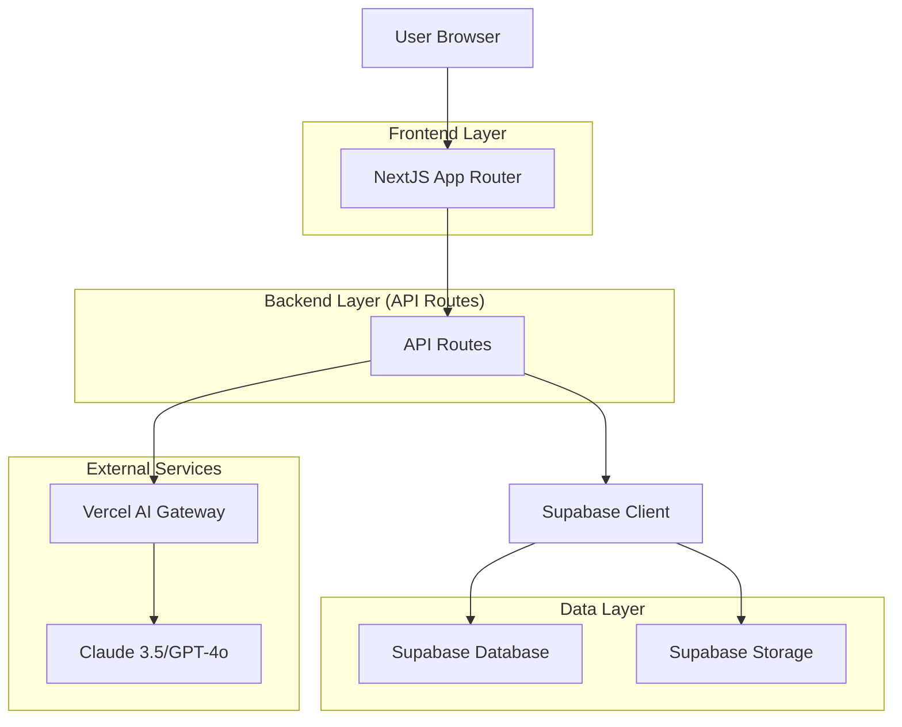
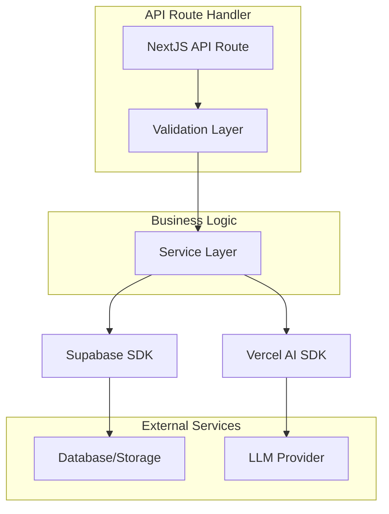
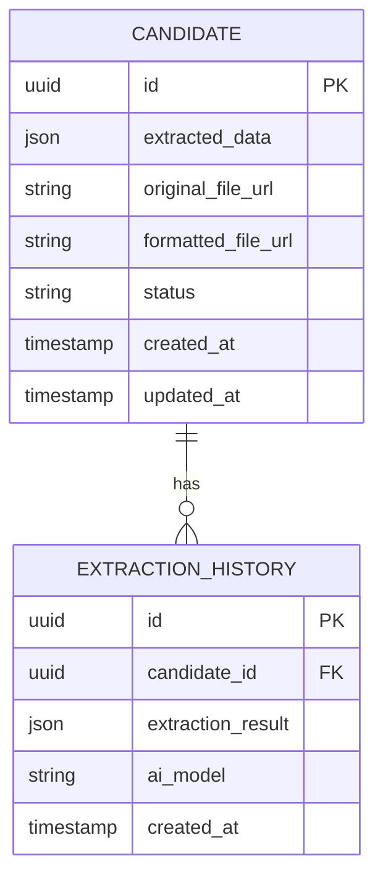

## 1. Architecture design



## 2. Technology Description

- Frontend: NextJS 14 (App Router) + React 18 + Tailwind CSS 3 + Shadcn UI
- Backend: NextJS API Routes (serverless functions)
- Database: Supabase (PostgreSQL)
- Storage: Supabase Storage (CV originaux)
- IA Gateway: Vercel AI SDK (Claude 3.5 Sonnet / GPT-4o)
- Document Generation: docx library
- Initialization Tool: create-next-app

## 3. Route definitions

| Route | Purpose |
|-------|---------|
| / | Upload CV page, zone drag-and-drop |
| /review/[id] | Review page, édition des données extraites |
| /export/[id] | Export page, génération du DOCX formaté |
| /api/upload | API pour upload CV vers Supabase Storage |
| /api/extract | API pour extraction IA des données CV |
| /api/generate | API pour génération DOCX avec charte Himeo |
| /api/candidates | API CRUD pour données candidats |

## 4. API definitions

### 4.1 Upload CV
```
POST /api/upload
```

Request (multipart/form-data):
| Param Name | Param Type | isRequired | Description |
|------------|------------|------------|-------------|
| file | File | true | CV au format PDF ou DOCX |
| jobDescription | string | false | Fiche de poste optionnelle |

Response:
```json
{
  "id": "uuid-candidat",
  "fileUrl": "https://storage.supabase.com/cv/original.pdf",
  "status": "uploaded"
}
```

### 4.2 Extract Data
```
POST /api/extract
```

Request:
| Param Name | Param Type | isRequired | Description |
|------------|------------|------------|-------------|
| candidateId | string | true | ID du candidat |
| fileUrl | string | true | URL du CV dans Supabase |

Response:
```json
{
  "personalInfo": {
    "name": "Jean Dupont",
    "title": "Développeur Full Stack",
    "email": "jean@email.com"
  },
  "experiences": [...],
  "skills": ["React", "Node.js", "PostgreSQL"],
  "summary": "Développeur avec 5 ans d'expérience..."
}
```

### 4.3 Generate DOCX
```
POST /api/generate
```

Request:
| Param Name | Param Type | isRequired | Description |
|------------|------------|------------|-------------|
| candidateId | string | true | ID du candidat |
| data | object | true | Données validées du formulaire |

Response:
```json
{
  "downloadUrl": "https://storage.supabase.com/cv/formatted/trame-himeo.docx",
  "fileName": "Jean_Dupont_CV_Himeo.docx"
}
```

## 5. Server architecture diagram



## 6. Data model

### 6.1 Data model definition



### 6.2 Data Definition Language

**Table candidates**
```sql
-- create table
CREATE TABLE candidates (
    id UUID PRIMARY KEY DEFAULT gen_random_uuid(),
    extracted_data JSONB NOT NULL DEFAULT '{}',
    original_file_url TEXT NOT NULL,
    formatted_file_url TEXT,
    status VARCHAR(50) DEFAULT 'uploaded' CHECK (status IN ('uploaded', 'extracting', 'reviewing', 'ready', 'generated')),
    created_at TIMESTAMP WITH TIME ZONE DEFAULT NOW(),
    updated_at TIMESTAMP WITH TIME ZONE DEFAULT NOW()
);

-- create indexes
CREATE INDEX idx_candidates_status ON candidates(status);
CREATE INDEX idx_candidates_created_at ON candidates(created_at DESC);
CREATE INDEX idx_candidates_extracted_data ON candidates USING GIN (extracted_data);

-- grant permissions
GRANT SELECT ON candidates TO anon;
GRANT ALL PRIVILEGES ON candidates TO authenticated;
```

**Table extraction_history**
```sql
-- create table
CREATE TABLE extraction_history (
    id UUID PRIMARY KEY DEFAULT gen_random_uuid(),
    candidate_id UUID REFERENCES candidates(id) ON DELETE CASCADE,
    extraction_result JSONB NOT NULL,
    ai_model VARCHAR(100) NOT NULL,
    created_at TIMESTAMP WITH TIME ZONE DEFAULT NOW()
);

-- create indexes
CREATE INDEX idx_extraction_candidate_id ON extraction_history(candidate_id);
CREATE INDEX idx_extraction_created_at ON extraction_history(created_at DESC);

-- grant permissions
GRANT SELECT ON extraction_history TO anon;
GRANT ALL PRIVILEGES ON extraction_history TO authenticated;
```

### 6.3 Supabase Storage Configuration

**Buckets:**
- `cv-original` : Stockage des CV uploadés (PDF/DOCX)
- `cv-formatted` : Stockage des CV générés (DOCX)

**Policies:**
```sql
-- Allow authenticated users to upload
CREATE POLICY "Allow upload" ON storage.objects
FOR INSERT TO authenticated
WITH CHECK (bucket_id = 'cv-original');

-- Allow public read access to formatted CVs
CREATE POLICY "Allow read formatted" ON storage.objects
FOR SELECT TO anon
USING (bucket_id = 'cv-formatted');
```