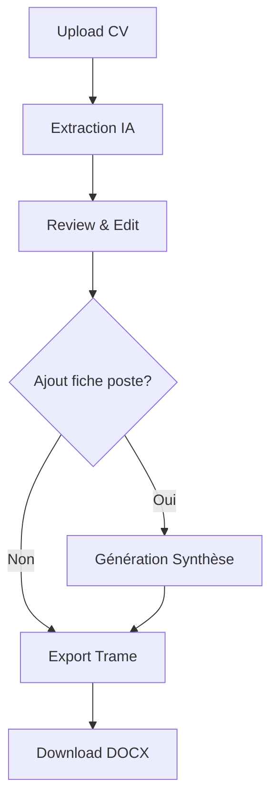

## 1. Product Overview

Outil d'automatisation de la "mise sous trame" des CV pour l'ESN Himeo, réduisant le temps de traitement de 40 minutes à quelques minutes par candidat. L'outil extrait, normalise et reformate automatiquement les CV selon la charte graphique Himeo en utilisant l'IA générative.

Problème résolu : Élimination des tâches répétitives de copier-coller manuel et des erreurs de formatage, permettant aux consultants de se concentrer sur l'évaluation des compétences techniques.

## 2. Core Features

### 2.1 User Roles

| Role | Registration Method | Core Permissions |
|------|---------------------|------------------|
| Consultant Himeo | Supabase Auth (email) | Upload CV, review data extraites, générer documents |
| Admin Himeo | Supabase Auth (email + role) | Gérer tous les CV, configurer templates, accès analytics |

### 2.2 Feature Module

L'outil de mise sous trame CV Himeo consiste en les pages suivantes :
1. **Upload CV** : Zone drag-and-drop pour téléverser les CV (PDF/DOCX)
2. **Review & Edit** : Formulaire de validation des données extraites par l'IA avec normalisation skills.sh
3. **Export Trame** : Génération et téléchargement du CV formaté selon la charte Himeo

### 2.3 Page Details

| Page Name | Module Name | Feature description |
|-----------|-------------|---------------------|
| Upload CV | Drag & Drop Zone | Accepte fichiers PDF/DOCX jusqu'à 10MB, affiche progression upload |
| Upload CV | File Preview | Affiche nom, taille et aperçu du fichier uploadé |
| Review & Edit | Données Personnelles | Édite nom, prénom, titre, email, téléphone, localisation |
| Review & Edit | Résumé Professionnel | Textarea avec résumé généré par l'IA, éditable |
| Review & Edit | Expériences | Liste dynamique des expériences (poste, entreprise, dates, missions) |
| Review & Edit | Formations | Liste des diplômes et formations avec dates |
| Review & Edit | Compétences Techniques | Tags de compétences normalisées skills.sh, ajout/suppression |
| Review & Edit | Synthèse Positionnement | 4-5 bullet points générés si fiche de poste fournie |
| Export Trame | Prévisualisation | Aperçu du CV formaté avec charte Himeo avant export |
| Export Trame | Génération DOCX | Crée fichier .docx avec logo Himeo, police officielle, structure fixe |

## 3. Core Process

**Flux Consultant Himeo :**
1. Le consultant téléverse un CV via la zone drag-and-drop
2. L'IA extrait et normalise les données en utilisant la taxonomie skills.sh
3. Le consultant vérifie et corrige les données dans le formulaire de review
4. Le consultant peut ajouter une fiche de poste pour générer une synthèse personnalisée
5. Le consultant génère et télécharge le CV formaté selon la charte Himeo

## 4. User Interface Design

### 4.1 Design Style
- **Couleurs principales** : Bleu Himeo (#1E40AF), Blanc (#FFFFFF), Gris clair (#F3F4F6)
- **Couleurs secondaires** : Bleu foncé (#1E3A8A), Gris texte (#374151)
- **Style des boutons** : Rounded corners (8px), hover states avec transition
- **Police** : Inter pour l'interface, Calibri pour les documents exportés (charte Himeo)
- **Layout** : Card-based design avec ombres subtiles, navigation top-bar fixe
- **Icônes** : Heroicons pour cohérence avec Shadcn UI

### 4.2 Page Design Overview

| Page Name | Module Name | UI Elements |
|-----------|-------------|-------------|
| Upload CV | Drag & Drop Zone | Zone grise pointillée de 400x200px, message "Glissez votre CV ici", bouton parcourir |
| Review & Edit | Formulaire | Sections collapsibles, champs avec labels au-dessus, boutons sauvegarder/annuler |
| Export Trame | Prévisualisation | Aperçu PDF embarqué, sidebar avec options d'export, bouton télécharger prominent |

### 4.3 Responsiveness
Desktop-first design avec adaptation mobile. L'interface principale est optimisée pour desktop (90% usage consultant), mais reste fonctionnelle sur tablette. Le mobile est supporté pour consultation uniquement.